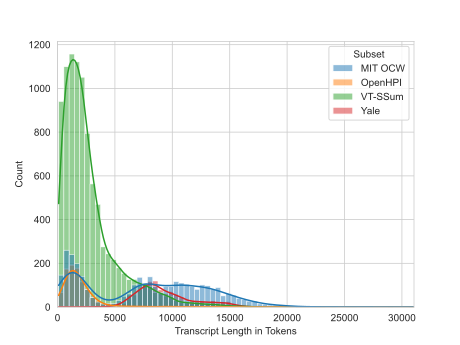

## OpenULTD
Open University Lecture Transcripts Dataset

To make the OpenULTD CSV files from the 4 available subsets, first complete all the steps required for each of them, then run the numbered script and Jupyter Notebook.

### Distribution Plots

