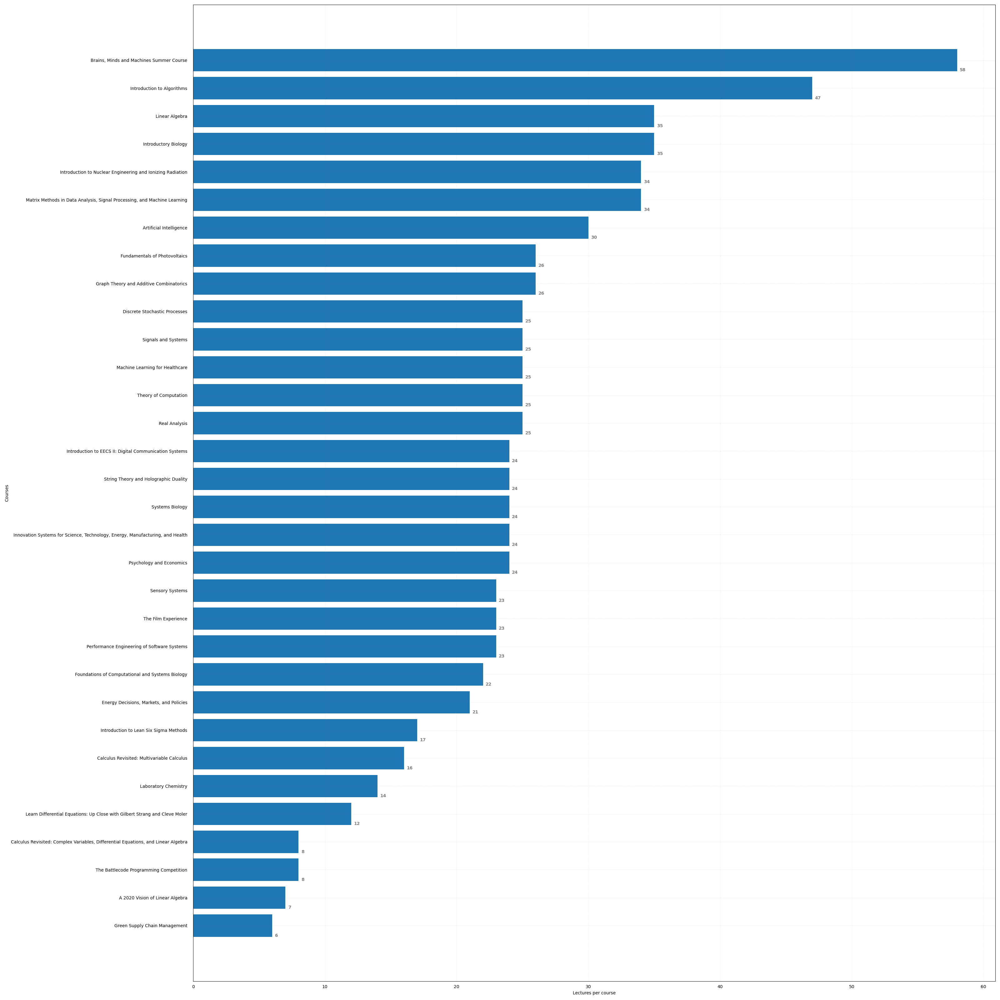
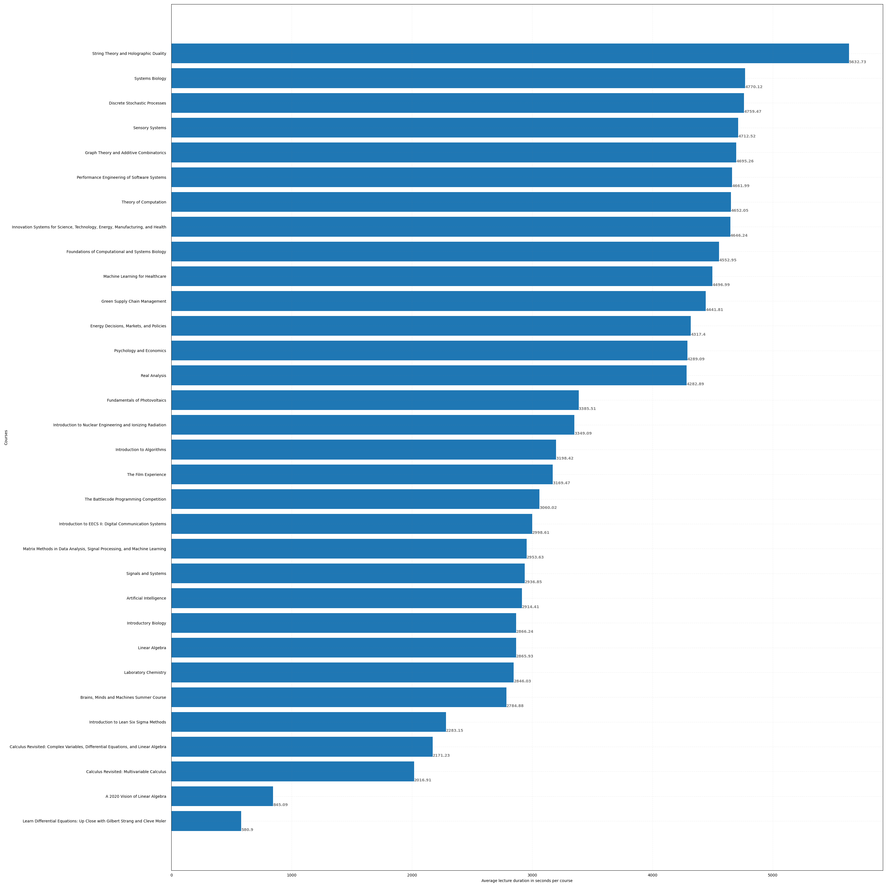
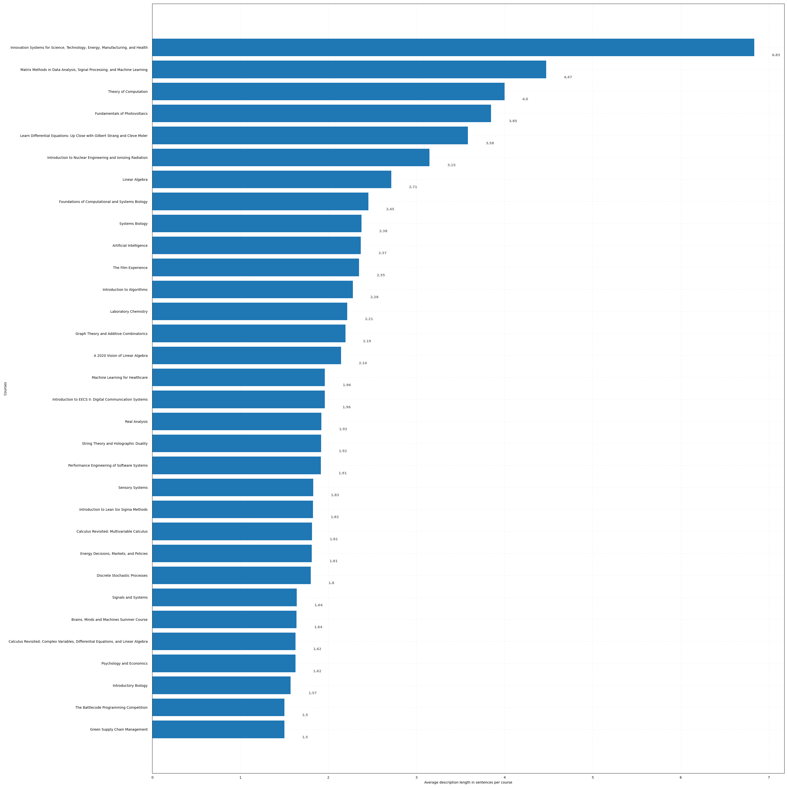
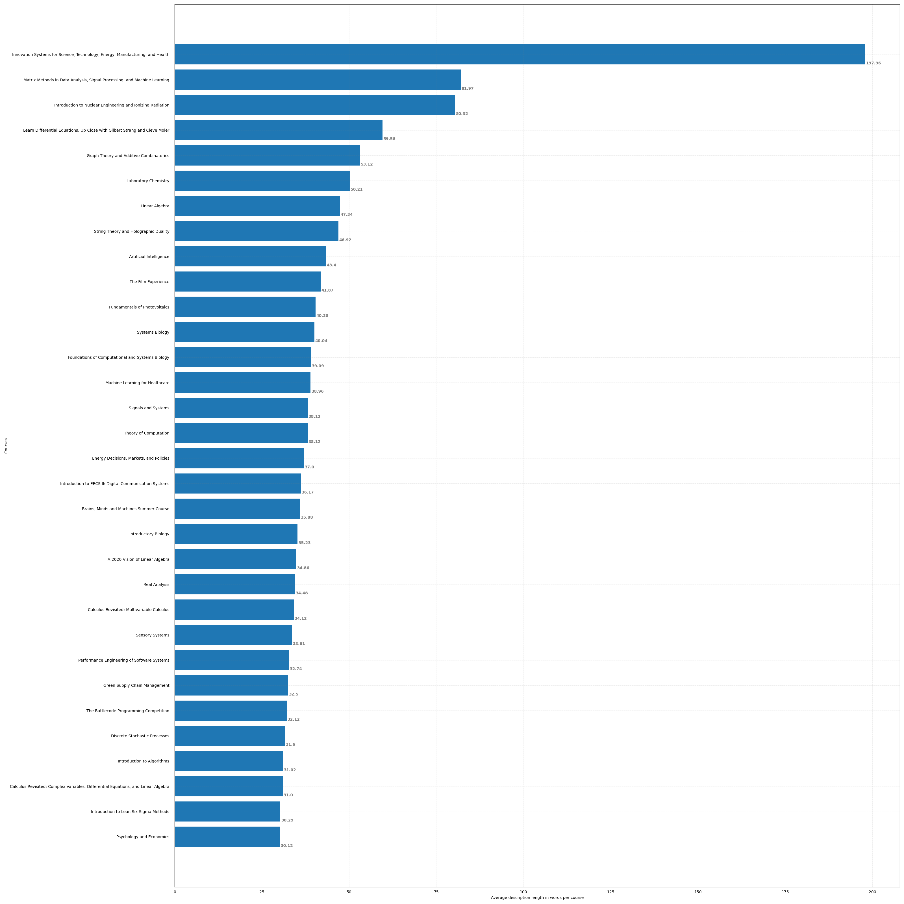
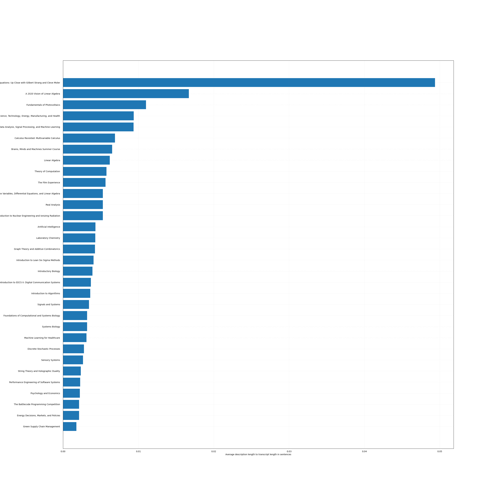
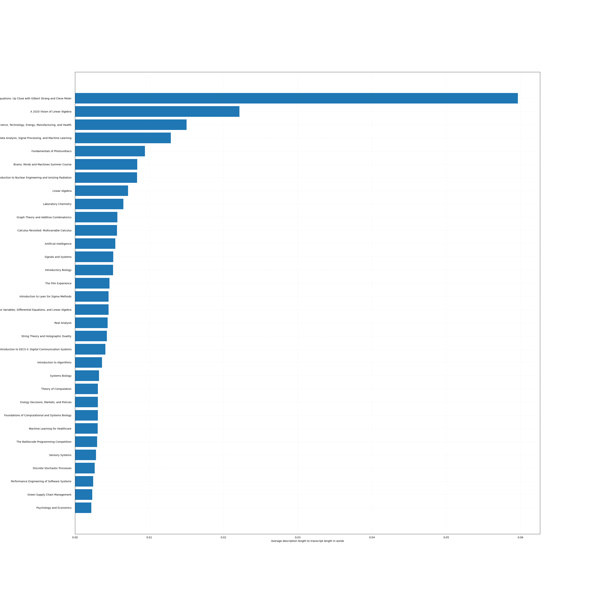

## MIT OCW Lectures Dataset

To use this code, run the 4 numbered scripts in order. They will:
1. scrape all available course data from the MIT OpenCourseWare platform using Selenium and its webdriver for Firefox
2. download all the lecture transcripts from the scraped URLs
3. print some stats and plot some histograms of the scraped data
4. clean the data by applying various criteria (remove short courses, remove courses with short descriptions, etc.) and remove many regex-matching parts from lecture transcripts and descriptions

### Analysis Plots

