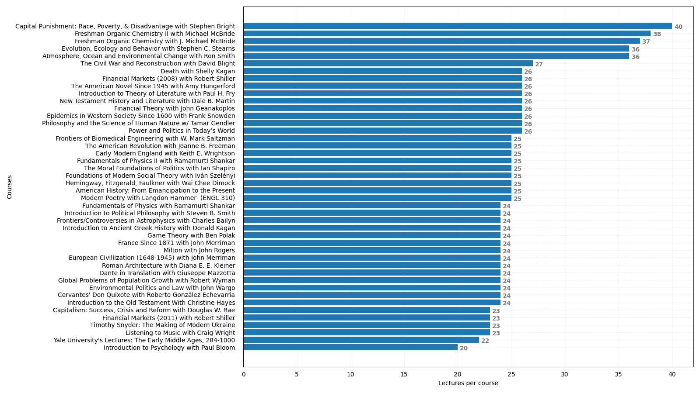
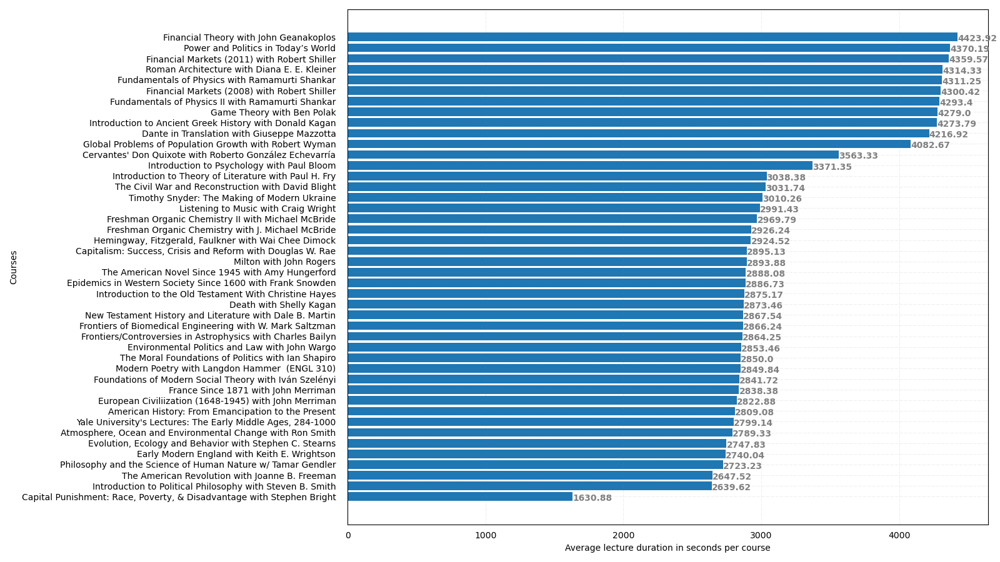
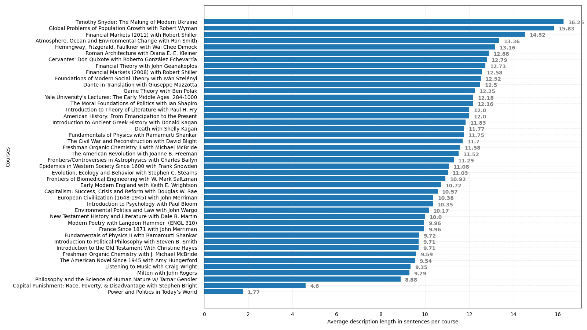
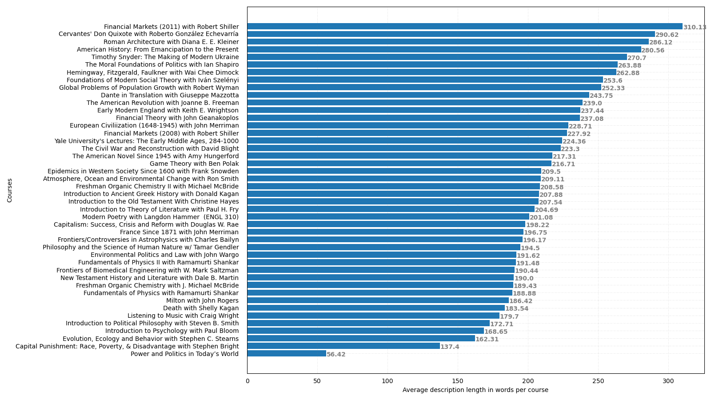
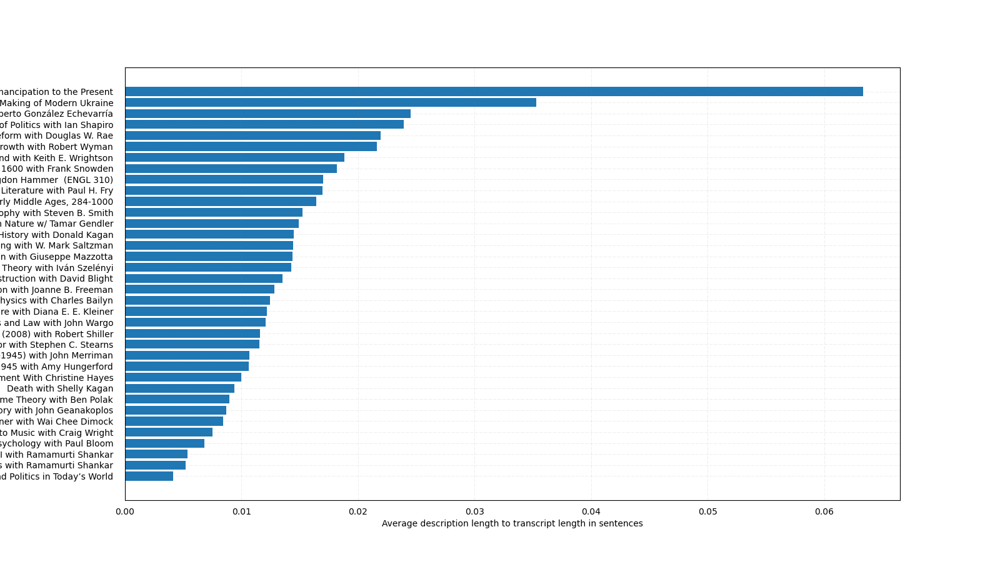
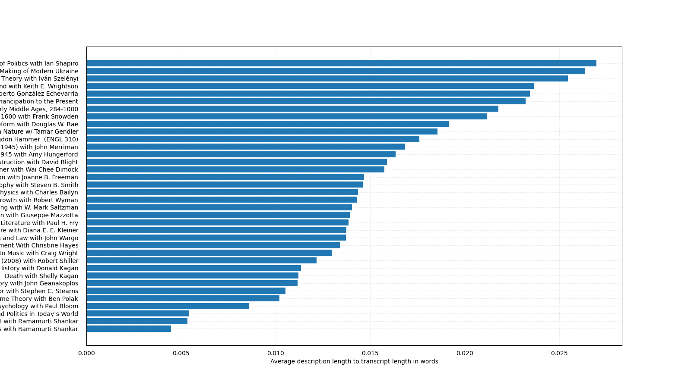

## Yale Lectures Dataset

To use this code, run the 4 numbered scripts in order. They will:
1. get the video metadata with the YouTube API v3 from a given list of playlist URLs (for this you will need to create a YouTube API key and paste it in common.py -- documentation [here](https://developers.google.com/youtube/v3/getting-started))
2. download all the lecture transcripts from the scraped URLs with `youtube-dl`, which you can download from https://youtube-dl.org
3. print some stats and plot some histograms of the scraped data
4. clean the data by applying various criteria (remove short courses, remove courses with short descriptions, etc.) and remove many regex-matching parts from lecture transcripts and descriptions

### Analysis Plots

